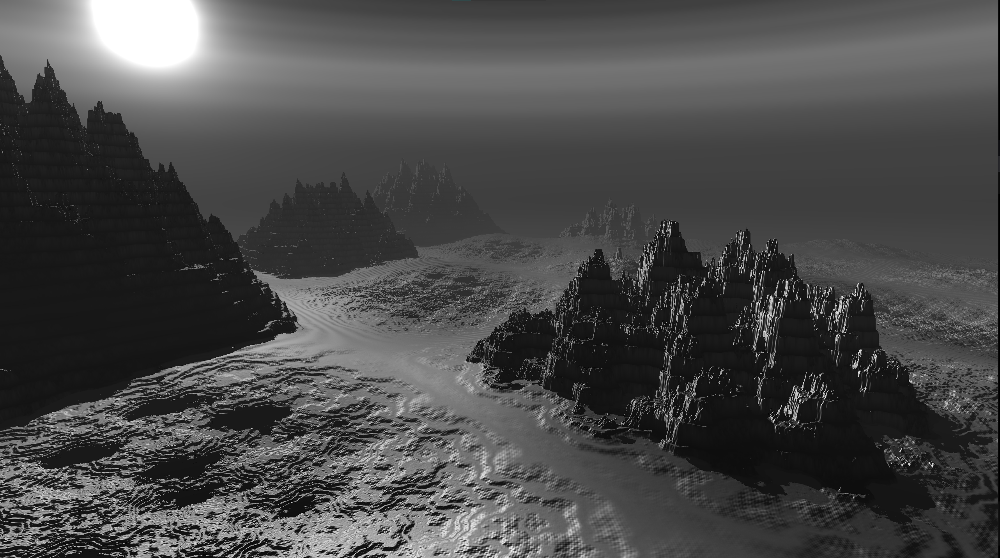
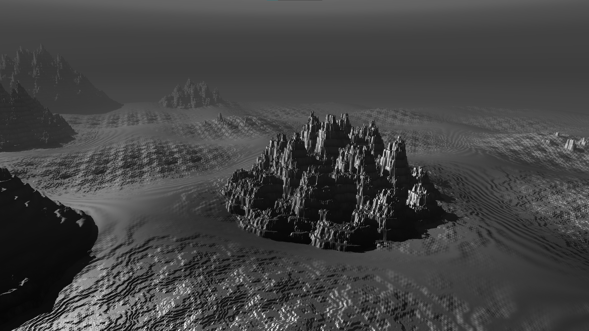
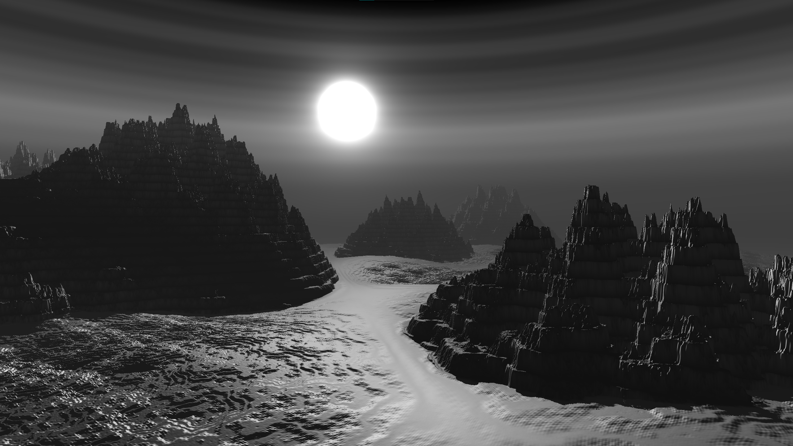
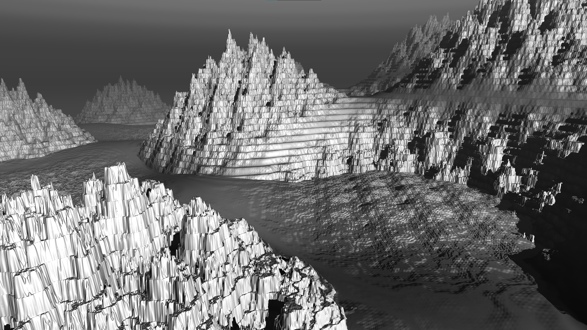

<h1 align="center">✨ Sine World ✨</h1>

<div align="center">
###### _A world made from the sine function_
</div>

## Explaination
This is a world generated using sine as the noise function.
Literally everything you see in the scene is made from sine.

### Noise Function

```math
N(p) = sin(p_x) + sin(p_y)
```

```glsl
float noise(vec2 p) {
    return sin(p[0]) + sin(p[1]);
}
```

This very simple noise function, which uses sine.
It creates a basic periodic pattern by combining
<br>
sine waves along both x and z axes.
It's later used to create all kinds of interesting features.

### Fractal Brownian Motion (FBM)

```glsl
float fbm(vec2 p) {
    float res = 0.0;
    float amp = 0.5;
    float freq = 1.95;
    for( int i = 0; i < NUM_OCTAVES; i++) {
        res += amp * noise(p);
        amp *= 0.5;
        p = p * freq * rot(PI / 4.0) - res * 0.4;
    }
    return res;
}
```

This function is an implementation of **Fractal Brownian Motion (FBM)**
<br>
This is more or less where the generation really takes place.
<br>
It makes use of the noise function generate practically everything.
<br>
You can modify its constants to change the world how you please.

- `res` stores the accumulated noise result.
- `amp` controls the amplitude of the noise.
- `freq` controls the level of detail in the noise. 

**It's mathematically expressed as:**
```math
FBM(p) = \sum_{i=0}^{n-1} A^i \cdot N(p \cdot F^i \cdot R_{\frac{\pi}{4}} - r \cdot 0.4)
```
**Where:**
```math
\begin{align*}
A &= 0.5 \text{ (amplitude)} \\
F &= 1.95 \text{ (frequency)} \\
R_{\theta} &= \begin{pmatrix} 
\cos(\theta) & -\sin(\theta) \\
\sin(\theta) & \cos(\theta)
\end{pmatrix} \text{ (rotation matrix)} \\
n &= 7 \text{ (number of octaves)} \\
r &= \text{running sum of previous iterations}
\end{align*}
```

### Terrain Generation

The terrain height at any point `(x,z)` is calculated through several layers:

```math
T(p) = \begin{aligned}[t]
&-130 \cdot N(p_{xz} \cdot 0.002) \\
&+ 80 \cdot N(p_{xz} \cdot 0.01) + 80 \\
&+ 20 \cdot FBM(p_{xz} \cdot 0.1) \cdot N(p_{xz} \cdot 0.01) + 20 \\
&- 2 \cdot \sin(0.6 \cdot d) \\
&+ p_y + 2
\end{aligned}
```

1. Large-scale features:
```glsl
d = -130 * noise(p.xz * 0.002);
```
This creates broad terrain features due to the small frequency constant

2. Medium-scale features:
```glsl
d += 80 * noise(p.xz * 0.01) + 80;
```
This adds medium-sized variations with a higher frequency (0.01)

3. Fine details through `FBM`:
```glsl
d += 20 * fbm(p.xz * 0.1) * noise(p.xz * 0.01) + 20;
```
This multiplies `FBM` with noise to create complex surface detail

4. Sine-based undulation:
```glsl
d -= 2.0 * sin(0.6 * d);
```
This adds subtle wave-like variations based on the existing height

### Water Generation
The water surface is generated separately using:
```math
W(p, t) = p_y + 5 \cdot \sin(t) + 80 + 6 \cdot N(p_{xz} \cdot 0.02 + t)
```

```glsl
d = y + 5.0 * sin(u_time) + 80.0;
d += 6.0 * noise(p.xz * 0.02 + u_time);
```

**This creates:**
1. A base water level at `y=80`
2. Vertical oscillation with amplitude 5.0
3. Small waves using noise with temporal animation

### Final Surface Function
This function creates the final world surface by blending terrain and water:
```math
S(p) = \min(\frac{T(p)}{10}, W(p, t) + \frac{T(p)}{10})
```

1. `T(p) / 10` is the terrain height scaled down by 1/10 to control the elevation scale
2. `W(p,t) + T(p) / 10` is the water surface adding to the terrain influence, creating:
- Underwater terrain visibility
- Shore interactions where water meets land
- Varying water depths

The `min()` function effectively creates the final surface by:
- Taking the lower value between terrain and water at each point
- Creating a smooth transition at shorelines
- Allowing underwater terrain to influence the water surface

### Distance Function (Ray Marching)
```math
D(p) = \min_{i=0}^{580} \{ d_i : |S(o + d_i \cdot r)| < \epsilon \}
```
This function implements the ray marching algorithm, where:

1. Starting condition:
```math
d_0 = 0
```

2. Iterative step:
```math
d_{i+1} = d_i + S(o + d_i \cdot r)
```
3. Termination conditions:
```math
\begin{cases}
|S(p)| < \epsilon & \text{(hit surface)} \\
d_i > 1800 & \text{(exceeded max distance)} \\
i = 580 & \text{(exceeded max steps)}
\end{cases}
```

This process works by:
1. Starting at the ray origin (`o`)
2. Moving along the ray direction (`r`)
3. Using the signed distance function `S(p)` to determine:
- How far we can safely march without missing surface details
- When we've hit a surface (`distance < ε`)
- When to give up (max distance or steps reached)

This is all implemented as:
```glsl
float rayMarch(vec3 ro, vec3 rd) {
    float dist = 0.0;
    for (int i = 0; i < STEPS; i++) {
        vec3 p = ro + dist * rd;
        float hit = map(p);
        if (abs(hit) < EPSILON) break;
        dist += hit;
        if (dist > MAX_DIST) break;
    }
    return dist;
}
```

The efficiency and accuracy of the ray marching depends on:
- **EPSILON** (0.001): Controls the surface precision
- **MAX_DIST** (1800.0): Maximum ray travel distance
- **STEPS** (580): Maximum iteration count

## Requirements
- Python3.10 or higher
- [ModernGL](https://github.com/moderngl/moderngl) & [pygame](https://github.com/pygame/pygame)

```sh
pip install moderngl pygame
```

## Showcase





